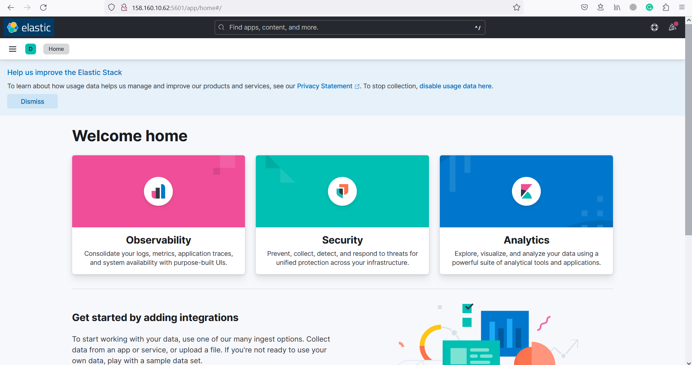

# Домашнее задание к занятию "15.Система сбора логов Elastic Stack"
1. Скриншот docker ps:  
     
   Скриншот интерфейса kibana:  
   
   Мой [docker-compose манифест](./docker-compose/logs.yml)  
   Мои [конфигурационные файлы](./docker-compose/files/)

2. Моё [приложение](./app/myapp.py) для генерации логов и [docker-compose файл](./app/myapp.yml) для его запуска.  
   Логи из моего приложение отображающиеся в Kibana:  
   